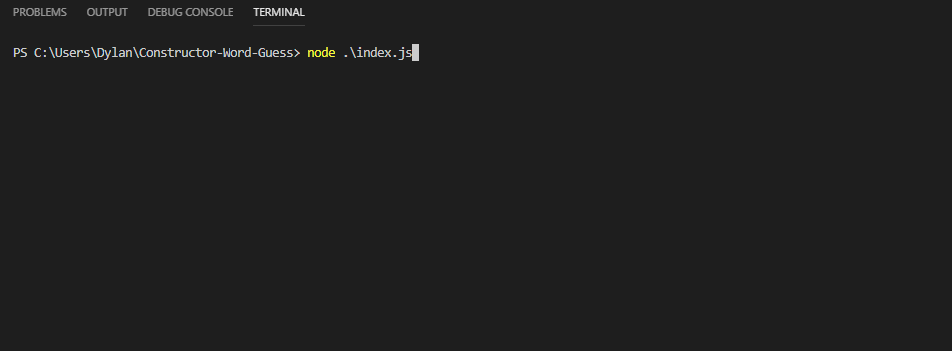
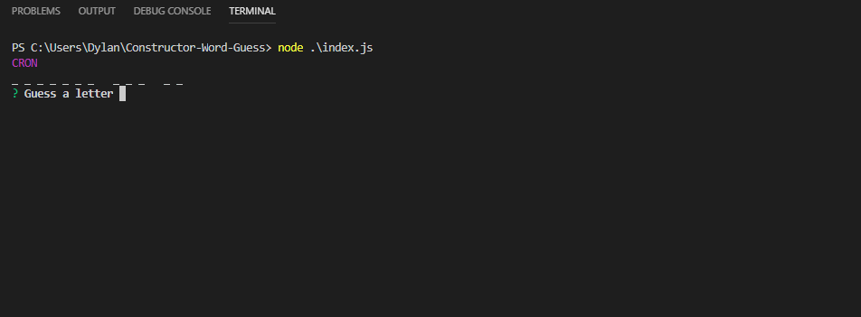
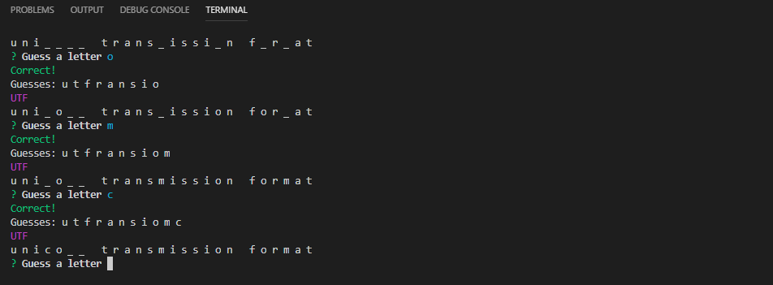

# Constructor-Word-Guess
CLI Hangman style game written in Node designed teach the player common web development acronyms. When the user starts the game, they are shown a web development acronym (such as HTTP) and are prompted to guess all of the letters in the full word (Hypertext Transfer Protocol). The Inquirer prompt validates input to ensure that the user is entering single alphabetical `[a-z]i` characters that have not already been guessed. If the user guesses the complete word, or inputs too many incorrect guesses, the game grabs the next word unless there are no more rounds or words remaining. 

## Challenges
Challenges included separating logic into different files and objects, as well as dealing with the asyncronous nature of Inquirer prompts. I tried to keep the logic where it made sense; for example, letter comparison is handled by a method in the Letter objects. I also had to make sure most of the guess logic was contained within the `then` function after the prompt.

## Potential changes
* Accept input of a character without the user needing to hit enter
    * OR allow user to guess multiple letters at a time
* Update display without simply printing new lines each time. Inquirer might have functionality for this.
* Incorporate this logic into a web page hosted on Heroku

## Packages used: 
* [Inquirer](https://www.npmjs.com/package/inquirer) for prompting user input
* [Colors](https://www.npmjs.com/package/colors) for command line text styling

## Letter.js
Each letter in the game is represented by an object created with the Letter constructor. It expects a single character string and contains the property `isGuessed`, which is initialized to `false` unless that character happens to be a whitespace (this allows words to contain spaces). It includes a `compare` method which updates `isGuessed` to true if the parameter being compared is equal to the `letter` property. `toString` is overriden so that the object is printed as `_` if it has not been guessed, or the character itself if it has already been guessed. This method allows the game to hide letters until the user guesses them correctly.

## Word.js
Like letters, each word in the game is an object that is created using the Word constructor. This constructor requires `Letter.js`. It expects a single object that looks like this: `{hint/acronym: wordString}`. The `word` property is initliazed by taking the wordString, splitting it into an array, and mapping it into an array of Letter objects. It also stores a hint/acronymn as a property. Its `getWord` method joins the Letter object array, invoking each Letter's `toString` method. `guessLetter` iteraters the Letter array, calling `compare` on each letter and returns true/false based on whether one or more of the Letters have been correctly guessed. The `isGuessed` method checks to see if the word has been completely guessed, and returns true if every Letter has been guessed; otherwise it will return false. Finally, `toString` is overriden to display the hint, then splits the letter array (again invoking Letter's toString) before joining these letters into a string seprated by spaces for readability.

## words.js
This file simply stores a wordlist of objects like `{hint/acronym: wordString}` in a separate file. I am currently debating whether there is a better format to store these values in, but for now it is a JavaScript file.

## index.js
As the main driver of the program, this file requires `Word.js`, `words.js`, `inquirer`, and `colors`. 

It contains the `WordGuess` constructor which creates our game object. It expects an array of words (as objects like the one in words.js) and the number of rounds to be played. The game stores `guessesRemaining`, previous `guesses`, and the number of `correctGuesses` and `incorrectGuesses` as properties as well. 

`nextWord` selects a random word, creates a new Word object, and removes that word from the array so that it is not chosen again. 

`displayCurrentWord` simple console.logs the current word using Word's overriden `toString`

`promptNextWord` decrements rounds remaining, resets guesses, gets and displays the next word, then finally prompts the user for guesses.

`start` begins the game by getting the first word, displays it, and prompts for a guess.

`promptForGuess` contains the inquirer prompt which receives user input. It validates the input and asks the user to try again if the letter has been guessed or if the guess is not a single alphabetical character.  It determines if the guess is correct, notifying the user and updating the object's state accordingly. It then decides whether to get the next word and prompt again or display the game over screen with the number of correct and incorrect guesses.

Finally, it creates a game object using words from `words.js` and a default round number of 5, then starts the game.

## Examples

### Gameplay

### Failing to guess a word

### Game Over

